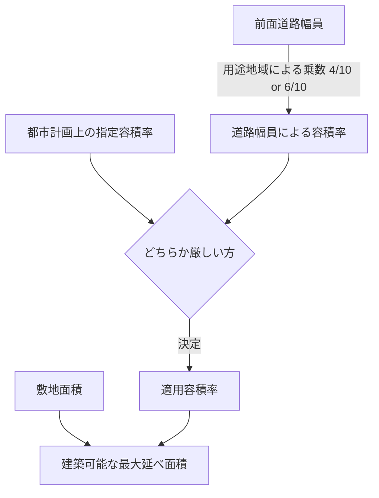

---
format:
  html:
    theme: darkly
    toc: true
    embed-resources: true
---

# 🏗 FP1 FAR Calculator (容積率・建蔽率シミュレータ)

## 🎯 アプリの目的と概要
**FP1 FAR (Floor Area Ratio) Calculator** は、不動産分野における最重要計算問題である「指定容積率と前面道路幅員による容積率の厳しい方の判定」を、ビジュアルを交えて瞬時に行うシミュレータです。

## ✨ 主な機能と特徴
| 機能 (Feature) | 説明 (Description) |
| :--- | :--- |
| **法定乗数の自動適用** | 用途地域（住居系か、その他の商業・工業系か）を選択するだけで、「4/10」または「6/10」の法定乗数を自動適用して道路幅員容積率を計算します。 |
| **厳しい方の自動判定** | 「指定容積率」と「道路幅員による容積率」を比較し、実際に適用される（厳しい方の）容積率を赤字でハイライトします。 |
| **延べ面積の算出** | 敷地面積を入力すれば、直ちに建築可能な「最大延べ床面積」が計算されます。 |

## 🚀 使い方 (Usage Guide)
1. 敷地が接している「前面道路の幅」をメートル単位で入力します。
2. その土地の「用途地域（住居系など）」と「指定容積率」を選択します。
3. 画面下部に、適用される容積率と、建築基準法上の最大延べ床面積が即座に表示されます。
