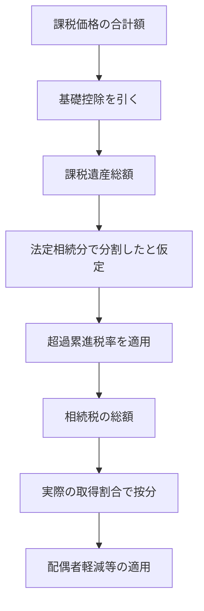

# 📜 FP1 Inheritance Tax (相続税算定シミュレータ)

## 🎯 アプリの目的と概要
**FP1 Inheritance Tax (Souzoku)** は、日本の複雑な相続税計算プロセス（遺産総額の算出 → 基礎控除 → 総額の計算 → 各人の納付税額）をステップバイステップでシミュレートするツールです。

## ✨ 主な機能と特徴
| 機能 (Feature) | 説明 (Description) |
| :--- | :--- |
| **法定相続人の判定** | 配偶者の有無、実子・養子の数（法定相続人の数に含める養子の数の制限ルール対応）を入力し、法定相続人を確定させます。 |
| **基礎控除の自動計算** | `3,000万円 + 600万円 × 法定相続人の数` の公式を用いて、課税遺産総額を算出します。 |
| **配偶者の税額軽減** | 「法定相続分」または「1億6,000万円」のいずれか多い金額まで無税となる特例をシミュレートできます。 |

## 🚀 使い方 (Usage Guide)
1. 被相続人の財産（プラスの財産から債務・葬式費用を引いた額）を入力します。
2. 家族構成（配偶者、子供の数）を入力し、「基礎控除額」を確認します。
3. 画面下部に表示される「相続税の総額」と、各相続人の「最終的な納付税額」を確認します。
